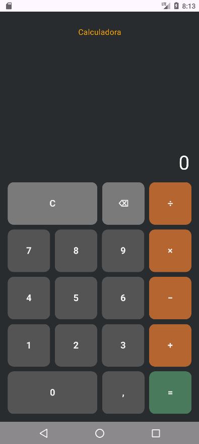

# 🧮 Calculadora App (Android)

A modern, minimalist, and interactive Android calculator application developed in **Kotlin** using **Jetpack Compose**. Features real-time state management, mathematical parsing with proper operator precedence, error handling, and a pixel-perfect UI grid.



---

## ✨ Features

- 🎮 **Classic Gameplay**: Fully functional calculator logic for basic math operations (addition, subtraction, multiplication, division).
- 🔄 **Real-Time UI Updates**: Dynamically updates the display as you type your mathematical expression.
- 📐 **Pixel-Perfect Grid Alignment**: Uses `BoxWithConstraints` to dynamically calculate cell widths, guaranteeing perfect symmetry and button proportions on any screen.
- 🧠 **Smart Math Parser**: Custom built-in evaluator that respects mathematical operator precedence (multiplication and division before addition and subtraction).
- 🛡️ **Error Handling**: Gracefully catches edge cases such as division by zero ("Erro ao dividir por 0") and auto-recovers when the user starts a new operation.
- 🚫 **Smart Input Validation**: Prevents invalid inputs like double decimals in the same number or consecutive math operators.
- 🎨 **Declarative UI**: Completely built with Jetpack Compose, the modern toolkit for building native Android UI, doing away with XML layouts.

---

## 🛠️ Technologies Used

- **Language:** [Kotlin](https://kotlinlang.org/)
- **IDE:** [Android Studio](https://developer.android.com/studio)
- **UI Toolkit:** Jetpack Compose
- **Components:** `Column`, `Row`, `BoxWithConstraints`, `Button`, `Text`, `Scaffold` (AndroidX / Compose)

---

## 📂 Project Structure

```text
├── app/
│   ├── src/main/
│   │   ├── java/dev/raul/calculadora/
│   │   │   ├── MainActivity.kt      # Main app logic, Compose UI tree, and math parser
│   │   │   └── ui/theme/
│   │   │       ├── Color.kt         # Custom color schemes for the app buttons and text
│   │   │       ├── Theme.kt         # Compose MaterialTheme definitions
│   │   │       └── Type.kt          # Typography configurations
│   │   └── AndroidManifest.xml
│   └── build.gradle.kts
└── build.gradle.kts
```

---

## 🚀 How to Run the Project

1. **Clone this repository:**
   ```bash
   git clone https://github.com/Raul-Brasiel/Mobile-Device-Programming.git
   ```

2. **Open in Android Studio:**
   - Open Android Studio.
   - Select **Open** and navigate to the cloned `Calculadora` project folder.
   - Wait for Gradle to sync dependencies.

3. **Run on Emulator or Physical Device:**
   - Connect your Android device via USB (with USB Debugging enabled) or launch an Android Virtual Device (AVD).
   - Click the **Run** button (`Shift + F10` or the green play icon ▶️).

---

## 👨‍💻 Author

Developed by **Raul**.