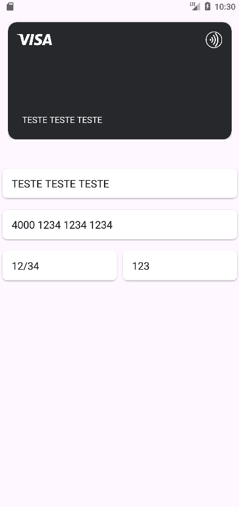
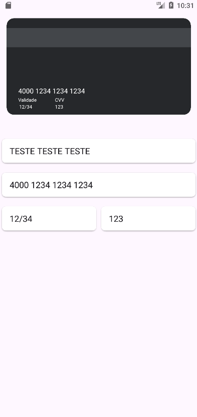

# 💳 Credit Card UI App (Android)

A dynamic and interactive Android application developed in **Kotlin** for credit card data entry, featuring a realistic 3D flip animation, real-time data mirroring, smart input masking, and automatic brand detection.




---

## ✨ Features

- 💳 **Realistic UI & 3D Flip**: Simulates the front and back of a credit card using `CardView`, flipping automatically to the back when entering the CVV.
- 🔄 **Real-Time Mirroring**: User inputs (Name, Number, Expiry, CVV) are instantly reflected on the digital card on the screen.
- 🛡️ **Smart Input Masking**: Automatically formats the card number (groups of 4) and expiry date (MM/YY) dynamically using Kotlin's native `.chunked()` function.
- 🏷️ **Brand Detection**: Automatically identifies and displays the credit card brand logo (Visa, Mastercard, Elo) based on the entered prefix.
- ✅ **Input Validation**: Ensures the cardholder's name has at least 3 characters before validation is passed.

---

## 🛠️ Technologies Used

- **Language:** [Kotlin](https://kotlinlang.org/)
- **IDE:** [Android Studio](https://developer.android.com/studio)
- **UI Toolkit:** Android Views (XML Layouts)
- **Components:** `ConstraintLayout`, `FrameLayout`, `CardView`, `EditText`, `ImageView` (AndroidX / AppCompat)

---

## 📂 Project Structure

````text
├── app/
│   ├── src/main/
│   │   ├── java/com/example/cartaodecredito/
│   │   │   └── MainActivity.kt      # Main app logic, flip animations, and text masks
│   │   ├── res/
│   │   │   ├── drawable/
│   │   │   │   └── ic_visa.png      # Brand logos (Visa, Mastercard, Elo, etc.)
│   │   │   ├── layout/
│   │   │   │   └── activity_main.xml # Layout for the input form and the interactive card
│   │   │   └── values/
│   │   │       └── colors.xml       # Custom color schemes (e.g., Purple)
│   │   └── AndroidManifest.xml
│   └── build.gradle.kts
└── build.gradle.kts
---
````
## 🚀 How to Run the Project

1. **Clone this repository:**
   ```bash
   git clone https://github.com/SEU_USUARIO/SEU_REPOSITORIO.git


2. **Open in Android Studio:**
   - Open Android Studio.
   - Wait for Gradle to sync dependencies.

3. **Run on Emulator or Physical Device:**
   - Connect your Android device via USB (with USB Debugging enabled) or launch an Android Virtual Device (AVD).
   - Click the **Run** button (`Shift + F10` or the green play icon ▶️).

---

## 👨‍💻 Author

Developed by **Raul**.
