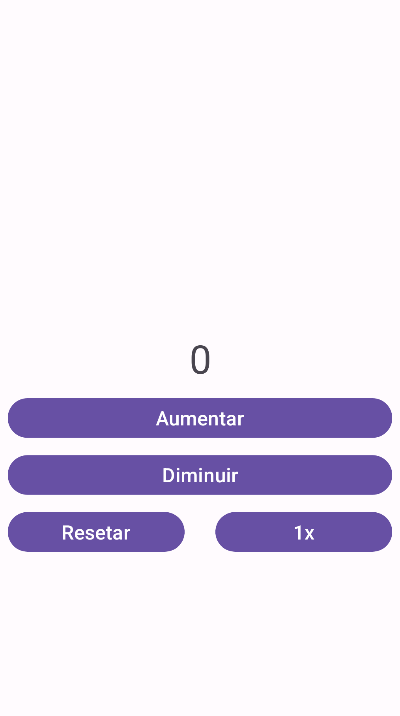

# 📱 Counter App (Android)

A simple, intuitive, and functional Android application developed in **Kotlin** for dynamic counting with step/speed control, negative value prevention, and reset confirmation via dialogs (`AlertDialog`).



---

## ✨ Features

- ➕ **Increment**: Increases the counter value according to the selected step/speed rate.
- ➖ **Safe Decrement**: Decreases the counter value and prevents negative numbers with an on-screen warning (`AlertDialog`).
- ⚡ **Speed / Step Adjustment**: Dynamically change the increment/decrement step (1x, 2x, 3x, etc.) with a single tap.
- 🔄 **Reset with Confirmation**: Displays an `AlertDialog` with _Yes/No_ options to confirm whether the user really wants to reset both the counter and the speed.
- 📐 **Responsive UI**: Built with `ConstraintLayout` and `Edge-to-Edge` support for modern Android displays.

---

## 🛠️ Technologies Used

- **Language:** [Kotlin](https://kotlinlang.org/)
- **IDE:** [Android Studio](https://developer.android.com/studio)
- **UI Toolkit:** Android Views (XML Layouts)
- **Components:** `ConstraintLayout`, `TextView`, `Button`, `AlertDialog` (AndroidX / AppCompat)
- **Build System:** Gradle com Kotlin DSL (`build.gradle.kts`)

---

## 📂 Project Structure

```text
Contador/
├── app/
│   ├── src/main/
│   │   ├── java/raul/contador/
│   │   │   └── MainActivity.kt      # Main app logic and dialogs
│   │   ├── res/
│   │   │   ├── layout/
│   │   │   │   └── activity_main.xml # Layout for buttons and counter
│   │   │   └── values/
│   │   │       └── strings.xml      # String resources
│   │   └── AndroidManifest.xml
│   └── build.gradle.kts
├── build.gradle.kts
└── settings.gradle.kts
```

---

## 🚀 How to Run the Project

1. **Clone this repository:**

   ```bash
   git clone https://github.com/YOUR_USERNAME/Mobile-Device-Programming.git
   ```

2. **Open in Android Studio:**
   - Open Android Studio.
   - Select **Open** and choose the project folder.
   - Wait for Gradle to sync dependencies.

3. **Run on Emulator or Physical Device:**
   - Connect your Android device via USB (with USB Debugging enabled) or launch an Android Virtual Device (AVD).
   - Click the **Run** button (`Shift + F10` or the green play icon ▶️).

---

## 👨‍💻 Author

Developed by **Raul**.
