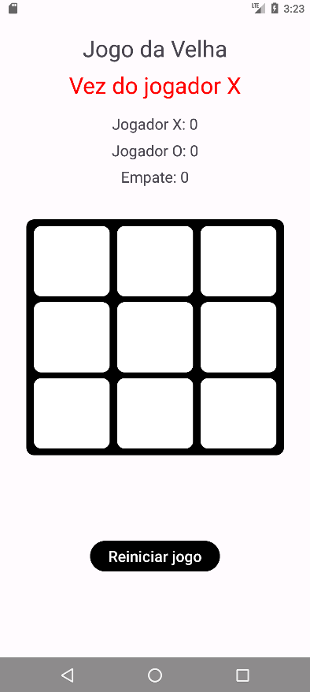
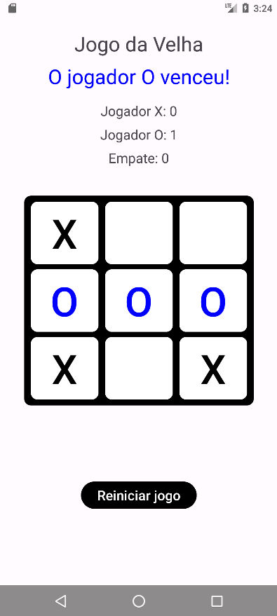

# ❌ Jogo da Velha (Tic-Tac-Toe) App (Android)

A classic and interactive Android application developed in **Kotlin** for playing Tic-Tac-Toe, featuring real-time turn tracking, smart win validation, simultaneous win detection, and dynamic UI updates.




---

## ✨ Features

- 🎮 **Classic Gameplay**: Fully functional Tic-Tac-Toe logic for two players (X and O) on a 3x3 grid.
- 🔄 **Real-Time Turn Tracking**: Dynamically updates the UI to show whose turn it is ("Vez do jogador X" / "Vez do jogador O").
- 🏆 **Smart Win Validation**: Checks all 8 possible winning combinations (rows, columns, and diagonals) after every move.
- 🎨 **Dynamic Win Highlighting**: Automatically changes the text color of the winning sequences to highlight the victory.
- 🧠 **Simultaneous Win Detection**: Capable of detecting and highlighting multiple winning lines at the same time (e.g., winning on two diagonals simultaneously).
- 🚫 **Post-Game Interaction Lock**: Automatically blocks all empty squares on the grid once a winner is found to prevent invalid moves.
- 🤝 **Draw Detection**: Accurately detects when the board is full without a winner and declares a draw ("Deu Velha!").
- 🔁 **Instant Reset**: Easily restart the match at any time or immediately after a game ends through intuitive alert dialogs.

---

## 🛠️ Technologies Used

- **Language:** [Kotlin](https://kotlinlang.org/)
- **IDE:** [Android Studio](https://developer.android.com/studio)
- **UI Toolkit:** Android Views (XML Layouts)
- **Components:** `GridLayout`, `Button`, `TextView`, `AlertDialog` (AndroidX / AppCompat)

---

## 📂 Project Structure

```text
├── app/
│   ├── src/main/
│   │   ├── java/com/example/jogodavelha/
│   │   │   └── MainActivity.kt      # Main app logic, win validation, and grid manipulation
│   │   ├── res/
│   │   │   ├── layout/
│   │   │   │   └── activity_main.xml # Layout containing the 3x3 GridLayout and turn indicators
│   │   │   └── values/
│   │   │       ├── colors.xml       # Custom color schemes for the app and text highlights
│   │   │       └── strings.xml      # App text resources
│   │   └── AndroidManifest.xml
│   └── build.gradle.kts
└── build.gradle.kts
```

---

## 🚀 How to Run the Project

1. **Clone this repository:**
   ```bash
   git clone https://github.com/Raul-Brasiel/Mobile-Device-Programming.git
   ```

2. **Open in Android Studio:**
   - Open Android Studio.
   - Select **Open** and navigate to the cloned project folder.
   - Wait for Gradle to sync dependencies.

3. **Run on Emulator or Physical Device:**
   - Connect your Android device via USB (with USB Debugging enabled) or launch an Android Virtual Device (AVD).
   - Click the **Run** button (`Shift + F10` ou o ícone verde de play ▶️).

---

## 👨‍💻 Author

Developed by **Raul**.
