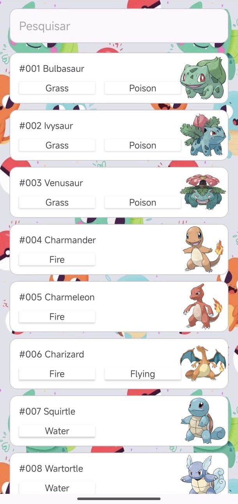
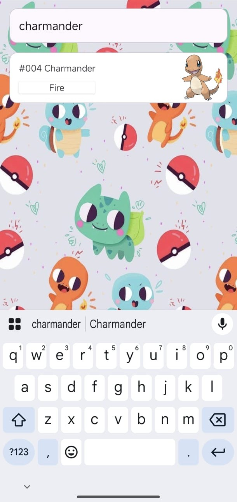

# 🐾 Pokédex App (Android)

A dynamic and interactive Android application developed in **Kotlin** that consumes the [PokeAPI](https://pokeapi.co/) to display a list of Pokémon. It features a custom user interface, real-time search functionality by name, ID, or type, and robust network integration.




---

## ✨ Features

- 🔍 **Smart Search**: Users can search for a Pokémon by its Name (e.g., "pikachu"), its ID (e.g., "25"), or even by its Type (e.g., "fire").
- ⚡ **Asynchronous Networking**: Efficiently fetches data from PokeAPI using Kotlin Coroutines (`async`/`awaitAll`), loading multiple Pokémon details in parallel for a smooth user experience.
- 🖼️ **Dynamic Image Loading**: Loads high-quality official artwork for each Pokémon directly from the web using **Glide**.
- 🛠️ **Debounce Search**: Implements a debounce mechanism (500ms delay) on the search bar to prevent unnecessary API calls and rate-limiting while the user is typing.
- ⚠️ **Empty States**: Displays a "Nenhum Pokémon encontrado" message gracefully when a search yields no results or encounters an error.

---

## 🛠️ Technologies Used

- **Language:** [Kotlin](https://kotlinlang.org/)
- **IDE:** [Android Studio](https://developer.android.com/studio)
- **UI Toolkit:** Android Views (XML Layouts)
- **Networking:** [Retrofit](https://square.github.io/retrofit/) & Gson Converter
- **Image Loading:** [Glide](https://github.com/bumptech/glide)
- **Asynchrony:** Kotlin Coroutines & Lifecycle Scope
- **Components:** `RecyclerView`, `ConstraintLayout`, `MaterialCardView`, `EditText`, `TextView`, `ImageView`

---

## 📡 API Consumed

This project relies on the free and open-source **[PokeAPI](https://pokeapi.co/)**.

### Endpoints Used:

- `GET https://pokeapi.co/api/v2/pokemon?limit={limit}&offset={offset}` - Fetches the initial list of Pokémon names and their detail URLs.
- `GET https://pokeapi.co/api/v2/pokemon/{id_or_name}` - Fetches specific details of a Pokémon (ID, Name, Types, and Sprites). Used for populating the cards and searching by Name/ID.
- `GET https://pokeapi.co/api/v2/type/{type_name}` - Fetches a list of Pokémon that share a specific element type (e.g., grass, water). Used as a fallback search mechanism.

---

## 🚀 How to Run (Compilation Instructions)

1. **Clone the Repository:**
   ```bash
   git clone <https://github.com/Raul-Brasiel/Mobile-Device-Programming>
   ```
2. **Open in Android Studio:**
   - Launch Android Studio.
   - Select **File > Open** and navigate to the cloned `Pokedex` folder.
   - Wait for Gradle to completely sync the project dependencies (Retrofit, Glide, Gson).
3. **Run the App:**
   - Select an emulator or a physical device connected via USB/Wi-Fi.
   - Click the **Run 'app'** button (the green play icon) in the top toolbar, or press `Shift + F10`.
   - **Important:** Ensure the device has an active internet connection to communicate with the PokeAPI.

---

## 👨‍💻 Author

Developed by **Raul**.
